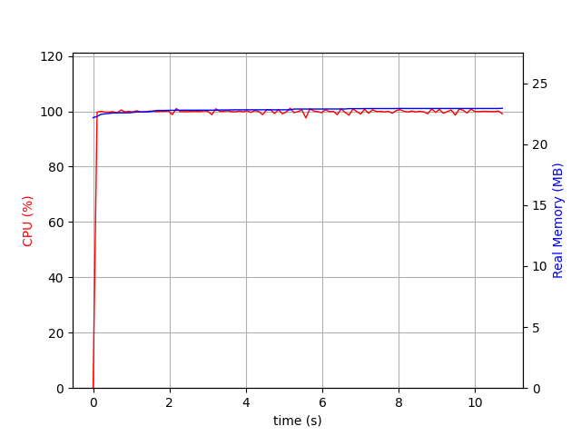
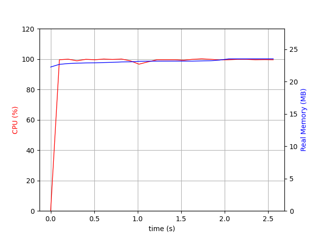
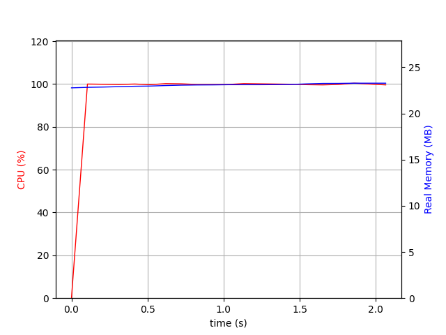
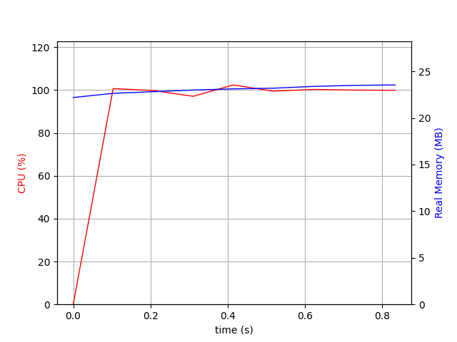
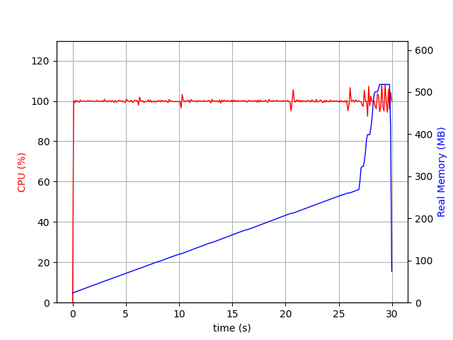
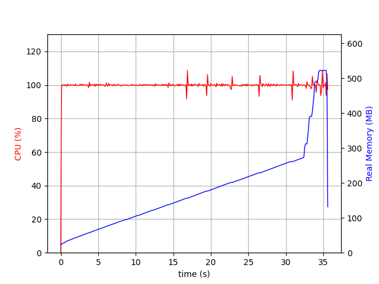
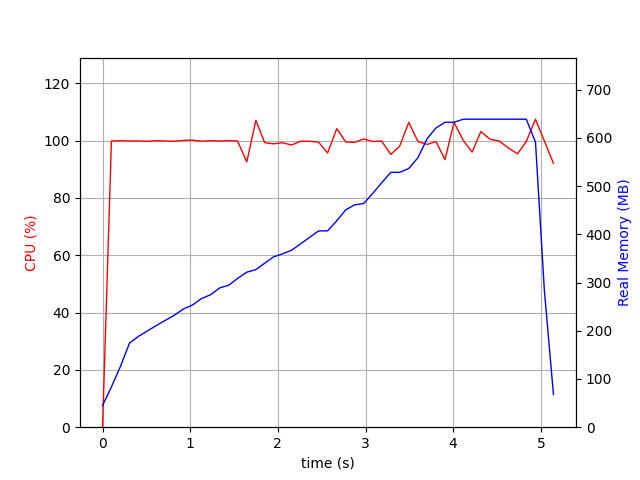

:doc:`/index`

.. _optimizations_label:

Optimizations
=============

If you are dealing with large nested objects and ignore_order=True, chances are DeepDiff takes a while to calculate the diff. Here are some tips that may help you with optimizations and progress report.

Max Passes
----------

:ref:`max_passes_label` comes with the default of 10000000.
If you don't need to exactly pinpoint the difference and you can get away with getting a less granular report, you can reduce the number of passes. It is recommended to get a diff of your objects with the defaults max_passes and take a look at the stats by running :ref:`get_stats_label` before deciding to reduce this number. In many cases reducing this number does not yield faster results.

.. _cache_size_label:

Cache Size
----------

cache_size : int >= 0, default=0
    Cache size to be used to improve the performance. A cache size of zero means it is disabled.
    Using the cache_size can dramatically improve the diff performance especially for the nested objects at the cost of more memory usage. However if cache hits rate is very low, having a cache actually reduces the performance.

**************
Cache Examples
**************

For example lets take a look at the performance of the benchmark_deeply_nested_a in the `DeepDiff-Benchmark repo <https://github.com/seperman/deepdiff-benchmark/blob/master/benchmark.py>`_ .

No Cache
^^^^^^^^

With the no cache option we have the following stats:

    {'PASSES COUNT': 11234, 'DIFF COUNT': 107060, 'DISTANCE CACHE HIT COUNT': 0, 'MAX PASS LIMIT REACHED': False, 'MAX DIFF LIMIT REACHED': False, 'DURATION SEC': 10}

Yes it has taken 10 seconds to do the diff!

   cache_size=0

Cache Size 500
^^^^^^^^^^^^^^

With a cache size of 500, we are doing the same diff in 2.5 seconds! And the memory usage has not changed. It is still hovering around 100Mb.

    {'PASSES COUNT': 3960, 'DIFF COUNT': 19469, 'DISTANCE CACHE HIT COUNT': 11847, 'MAX PASS LIMIT REACHED': False, 'MAX DIFF LIMIT REACHED': False, 'DURATION SEC': 2}

As you can see the number of passes and diff counts have gone down and instead the distance cache hit count has gone up.

   cache_size=500

Cache Size 500 and Cache Tuning Sample Size 500
^^^^^^^^^^^^^^^^^^^^^^^^^^^^^^^^^^^^^^^^^^^^^^^

With a cache size of 500, we set the :ref:`cache_tuning_sample_size_label` to be 500 too. And we have a slight improvement. we are doing the same diff in 2 seconds now. And the memory usage has not changed. It is still hovering around 100Mb.

    {'PASSES COUNT': 3960, 'DIFF COUNT': 19469, 'DISTANCE CACHE HIT COUNT': 11847, 'MAX PASS LIMIT REACHED': False, 'MAX DIFF LIMIT REACHED': False, 'DURATION SEC': 2}

As you can see in this case none of the stats have not changed compared to the previous stats.

   cache_size=500 cache_tuning_sample_size=500

Cache Size of 5000
^^^^^^^^^^^^^^^^^^

Let's pay a little attention to our stats. Particularly to 'DISTANCE CACHE HIT COUNT': 11847 and the fact that the memory usage has not changed so far. What if we bump the cache_size to 5000 and disable cache_tuning_sample_size?

    {'PASSES COUNT': 1486, 'DIFF COUNT': 6637, 'DISTANCE CACHE HIT COUNT': 3440, 'MAX PASS LIMIT REACHED': False, 'MAX DIFF LIMIT REACHED': False, 'DURATION SEC': 0}

We get the result calculated below 1 second! And the memory usage is only slightly above 100Mb.

   cache_size=5000

.. _cache_tuning_sample_size_label:

Cache Tuning Sample Size
------------------------

cache_tuning_sample_size : int >= 0, default = 0
    cache_tuning_sample_size is an experimental feature. It works hands in hands with the :ref:`cache_size_label`. When cache_tuning_sample_size is set to anything above zero, it will sample the cache usage with the passed sample size and decide whether to use the cache or not. And will turn it back on occasionally during the diffing process. This option can be useful if you are not sure if you need any cache or not. However you will gain much better performance with keeping this parameter zero and running your diff with different cache sizes and benchmarking to find the optimal cache size.

.. note::
    A good start with cache_tuning_sample_size is to set it to the size of your cache.

.. _diffing_numbers_optimizations_label:

Optimizations for Diffing Numbers
---------------------------------

If you are diffing lists of python numbers, you could get performance improvement just by installing numpy. DeepDiff will use Numpy to improve the performance behind the scene.

For example lets take a look at the performance of the benchmark_array_no_numpy vs. benchmark_numpy_array in the `DeepDiff-Benchmark repo <https://github.com/seperman/deepdiff-benchmark/blob/master/benchmark.py>`_.

In this specific test, we have 2 lists of numbers that have nothing in common: `mat1 <https://github.com/seperman/deepdiff-benchmark/blob/master/data/mat1.txt>`_ and `mat2 <https://github.com/seperman/deepdiff-benchmark/blob/master/data/mat2.txt>`_

No Cache and No Numpy
^^^^^^^^^^^^^^^^^^^^^

With the no cache option and no Numpy installed we have the following stats:

    {'PASSES COUNT': 1, 'DIFF COUNT': 439944, 'DISTANCE CACHE HIT COUNT': 0, 'MAX PASS LIMIT REACHED': False, 'MAX DIFF LIMIT REACHED': False, 'DURATION SEC': 30}

Yes it has taken 30 seconds to do the diff!

   cache_size=0 and no Numpy

Cache Size 10000 and No Numpy
^^^^^^^^^^^^^^^^^^^^^^^^^^^^^

What if we increase the cache size to 10000?

    {'PASSES COUNT': 1, 'DIFF COUNT': 439944, 'DISTANCE CACHE HIT COUNT': 0, 'MAX PASS LIMIT REACHED': False, 'MAX DIFF LIMIT REACHED': False, 'DURATION SEC': 35}

Not only it didn't help, it increased the diff time by 15%!!

Worse, if you look at the stats you see that the cache hit count is zero. This has happened since the 2 lists of items have nothing in common and hence caching the results does not improve the performance.

   cache_size=10000 and no Numpy

No Cache and Numpy
^^^^^^^^^^^^^^^^^^

Let's install Numpy now. Set the cache_size=0 and run the diff again.

Yay, the same diff is done in 5 seconds!

    {'PASSES COUNT': 1, 'DIFF COUNT': 1348, 'DISTANCE CACHE HIT COUNT': 0, 'MAX PASS LIMIT REACHED': False, 'MAX DIFF LIMIT REACHED': False, 'DURATION SEC': 5}

As you can see the memory usage has gone up from around 500Mb to around 630Mb.

   Numpy but no cache

.. _cache_purge_level:

Cache Purge Level
-----------------

cache_purge_level: int, 0, 1, or 2. default=1
    cache_purge_level_label defines what objects in DeepDiff should be deleted to free the memory once the diff object is calculated. If this value is set to zero, most of the functionality of the diff object is removed and the most memory is released. A value of 1 preserves all the functionalities of the diff object. A value of 2 also preserves the cache and hashes that were calculated during the diff calculations. In most cases the user does not need to have those objects remained in the diff unless for investigation purposes.

Back to :doc:`/index`
